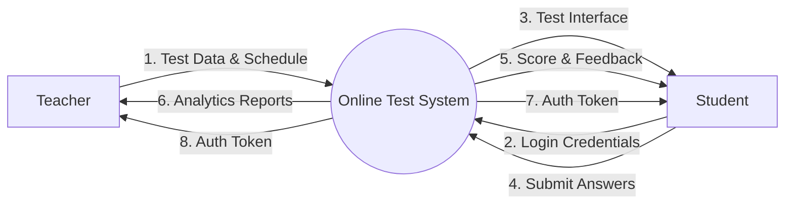
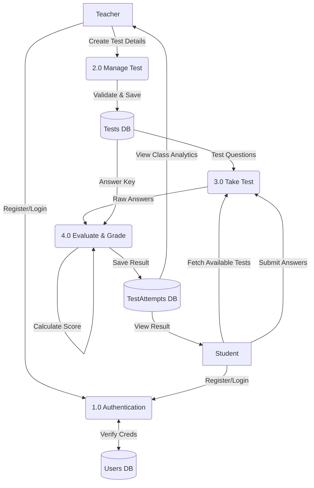
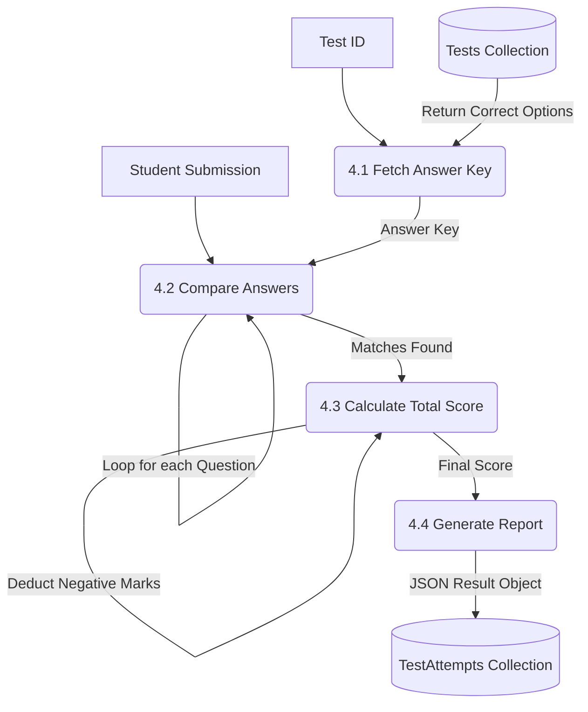

# 9. Data Flow Diagram (DFD)

The Data Flow Diagram (DFD) maps the flow of information for the **Online Test Taking Web Application**. It illustrates how data enters the system from external entities (Teacher, Student), how it is processed, and where it is stored.

## 9.1 Level 0 DFD (Context Diagram)
This diagram provides a high-level overview of the entire system as a single process, interacting with the external entities: Teacher, Student, and Administrator.

## 9.2 Level 1 DFD (System Overview)
This detailed diagram breaks down the main system into its core sub-processes: Authentication, Test Management, and Examination Processing. This matches the flow of operations from test creation to result generation.

## 9.3 Level 2 DFD (Detailed Grading Process)
This highly detailed diagram expands on **Process 4.0 (Evaluate & Grade)** from Level 1. It visualizes the internal logic of the automated scoring engine.

