## INDEX

| S.No. | Content | Page No. |
| :--- | :--- | :--- |
| 1. | Project Introduction | 1 |
| 2. | About Project | 1 |
| 3. | Objectives of the Project | 1 |
| 4. | Software Development Life Cycle | 2 |
| 5. | Software requirement | 2 |
| 6. | Hardware Requirement | 2 |
| 7. | Use Case Diagram | 3 |
| 8. | ER Diagram | 3 |
| 9. | Data Flow Diagram (DFD) | 4 |
| 10. | Database and Tables | 4 |
| 11. | Input / Output and Interface Design (Screen Shots) | 5-7 |
| 12. | Testing | 8 |
| 13. | Future Scope | 8 |
| 14. | Conclusion | 8 |
| 15. | References | 8 |

---

### 1. Project Introduction
The **Online Test Taking Web Application** is a sophisticated, full-stack educational platform designed to revolutionize the way examinations are conducted and managed. Built on the robust **MERN Stack** (MongoDB, Express.js, React.js, Node.js), this application addresses the critical need for remote assessment capabilities in modern educational environments. It serves as a comprehensive bridge between educators and learners, offering a seamless, secure, and efficient environment for creating, distributing, and analyzing tests.

By transitioning from traditional pen-and-paper assessments to a digital ecosystem, this project significantly reduces logistical overhead, minimizes paper waste, and accelerates the feedback loop through automated grading and real-time analytics.

### 2. About Project
This project is engineered to provide a holistic examination management system. It is divided into two primary functional modules:

**For Teachers (The Administrator Role):**
-   **Dashboard & Analytics:** A central hub to view active tests, student performance metrics, and historical data.
-   **Test Creation Engine:** A dynamic interface allowing specific configurations for test duration, scheduling (start/end times), and question types (Multiple Choice, Numerical).
-   **Result Management:** Automated grading systems that generate instant scorecards and detailed performance reports.

**For Students (The User Role):**
-   **Intuitive Test Interface:** A distraction-free environment for taking exams with real-time timers and auto-submission features.
-   **Instant Feedback:** Immediate access to results and correct answers (post-submission) to facilitate learning.
-   **Performance Tracking:** A personal dashboard to view past attempts and track progress over time.

The application leverages **Docker** for containerized deployment, ensuring consistency across development and production environments, and utilizes **JWT (JSON Web Tokens)** for secure, stateless authentication.

### 3. Objectives of the Project
**Primary Objectives:**
-   **Scalability:** To build a system capable of handling multiple concurrent users without performance degradation.
-   **Security:** To implement industry-standard security protocols (BCrypt for password hashing, JWT for session management) to protect sensitive student and examination data.
-   **User Experience (UX):** To design a responsive, accessible interface using **Tailwind CSS** that works seamlessly on desktops, tablets, and mobile devices.
-   **Automation:** To fully automate the grading process for objective questions, removing human error and drasticially reducing grading time.

**Secondary Objectives:**
-   **Data Analytics:** To provide actionable insights to teachers through visual analytics (charts/graphs) of class performance.
-   **Maintainability:** To allow for easy future updates by adhering to a modular component-based architecture in React and a clean MVC structure in the backend.

### 4. Software Development Life Cycle (SDLC) & Strategy
We adopted the **Agile Development Methodology** for this project, enabling iterative progress and flexibility:
1.  **Requirement Analysis:** Identified key pain points in traditional testing (grading time, cheating, logistics).
2.  **System Design:**
    -   **Frontend:** Component-based design using React.js (v19) for reusability.
    -   **Backend:** RESTful API architecture ensuring separation of concerns.
    -   **Database:** NoSQL schema design with MongoDB Mongoose (v9) for flexible data modeling.
3.  **Implementation (Coding):**
    -   Developed the **Backend** first to establish API endpoints and data validation.
    -   Built the **Frontend** using Vite for a fast development experience, integrating with the backend via Axios.
4.  **Testing:**
    -   **Unit Testing:** Verified individual components and API routes.
    -   **Integration Testing:** Tested full user flows (Login -> Create Test -> Take Test).
5.  **Deployment:** utilized Docker Compose to orchestrate valid container states for the Client, Server, and Database.

### 5. Software Requirements
-   **Frontend Framework:** React.js v19
-   **Build Tool:** Vite v5
-   **Styling:** Tailwind CSS v3
-   **Backend Runtime:** Node.js (Latest LTS)
-   **Server Framework:** Express.js v5
-   **Database:** MongoDB (Drivers v6, Mongoose v9)
-   **Authentication:** JSON Web Tokens (JWT), BCrypt.js
-   **PDF Generation:** Puppeteer (for report exports)
-   **Containerization:** Docker & Docker Compose

### 6. Hardware Requirements
-   **Server Side:** 
    -   Minimum 2 vCPUs
    -   4GB RAM (Recommended for handling concurrent database operations)
    -   10GB SSD Storage
-   **Client Side:** 
    -   Standard Desktop/Laptop or Mobile Device
    -   Modern Web Browser (Chrome, Firefox, Edge, Safari)
    -   Stable Internet Connection (1 Mbps+)

---

### 7. Use Case Diagram


### 8. ER Diagram

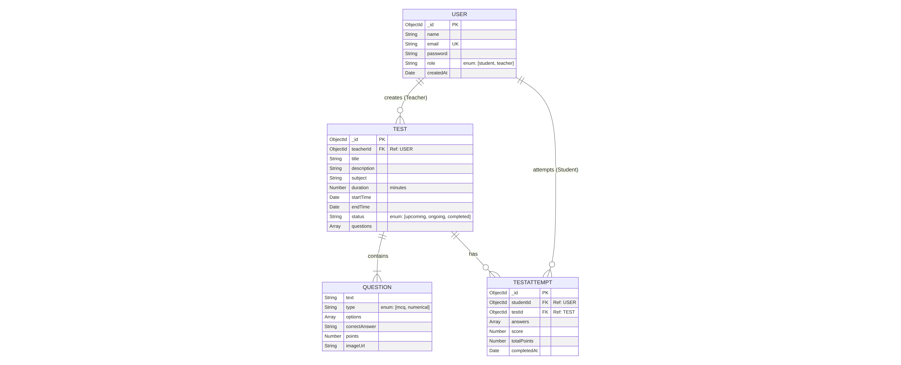

### 9. Data Flow Diagram (DFD)

**Level 0 DFD**

```mermaid
graph LR
    User[User (Student/Teacher)] -- Login/Register --> Auth[Auth System]
    Auth -- Token --> User
    Teacher -- Create Test Data --> TestSys[Test Management System]
    TestSys -- Test Details --> Student
    Student -- Submit Answers --> TestSys
    TestSys -- Result/Score --> Student
    TestSys -- Analytics --> Teacher
    TestSys -- Save/Retrieve --> DB[(Database)]
```

**Level 1 DFD (Test Process)**

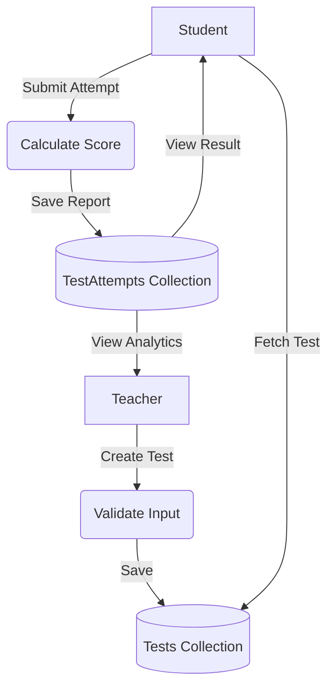

### 10. Database and Tables

**Collection: Users**
Stores user information including authentication details and roles.
- `_id`: Unique Identifier
- `name`: Full Name
- `email`: Email Address (Unique)
- `password`: Hashed Password
- `role`: 'student' or 'teacher'

**Collection: Tests**
Stores details of tests created by teachers.
- `teacherId`: Reference to User (Teacher)
- `questions`: Array of embedded Question objects
- `status`: Lifecycle of test (upcoming/ongoing/completed)

**Collection: TestAttempts**
Stores the submissions and scores of students.
- `studentId`: Reference to User (Student)
- `testId`: Reference to Test
- `score`: Marks obtained
- `answers`: Array of student's answers

---

### 11. Input/ Output and Interface Design

**(Placeholders for Project Screenshots)**

#### Login Page
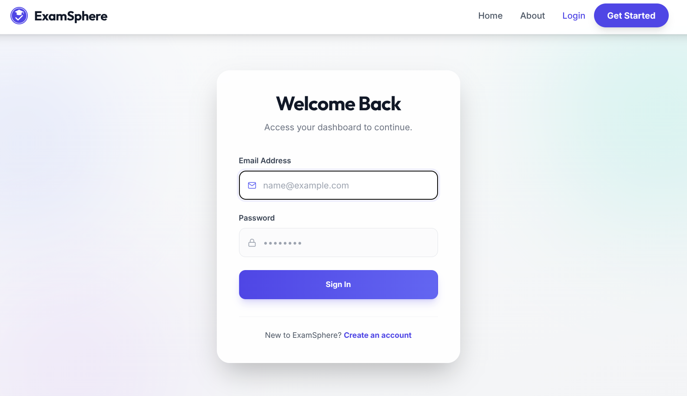

#### Sign Up Page
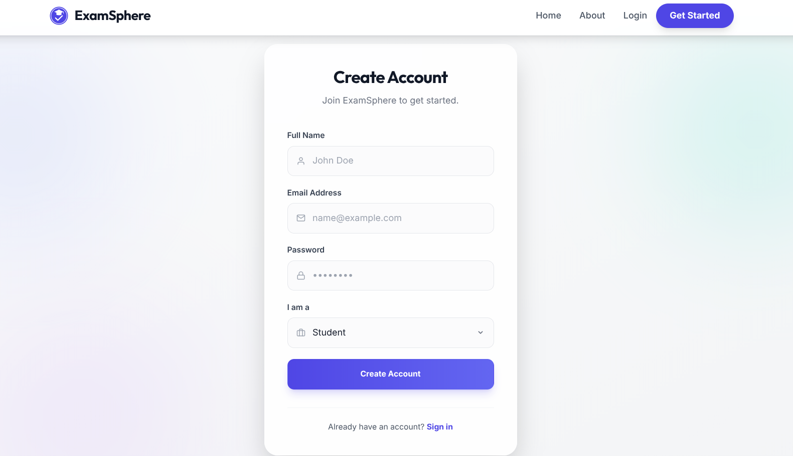

#### Teacher Dashboard
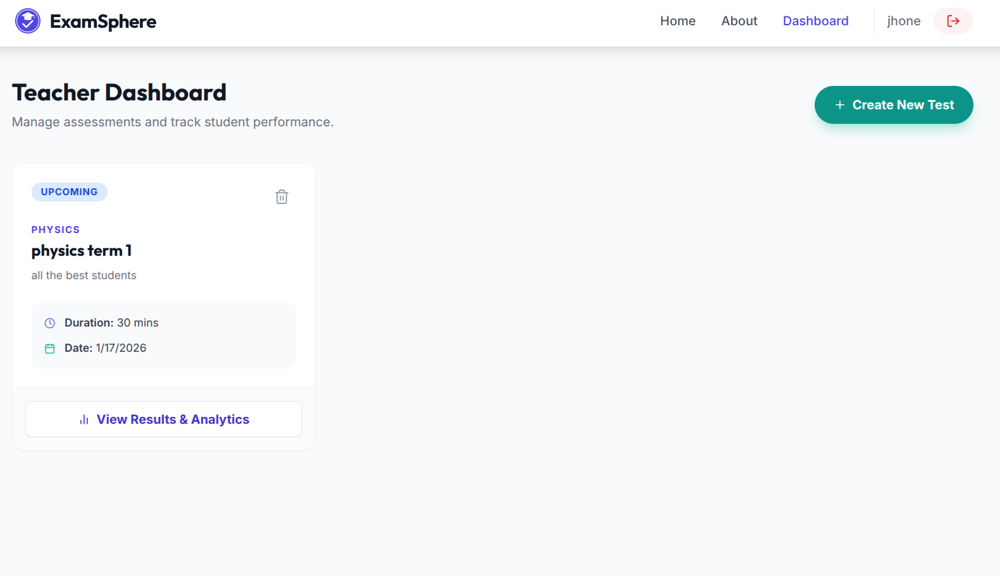

#### Teacher Analytics
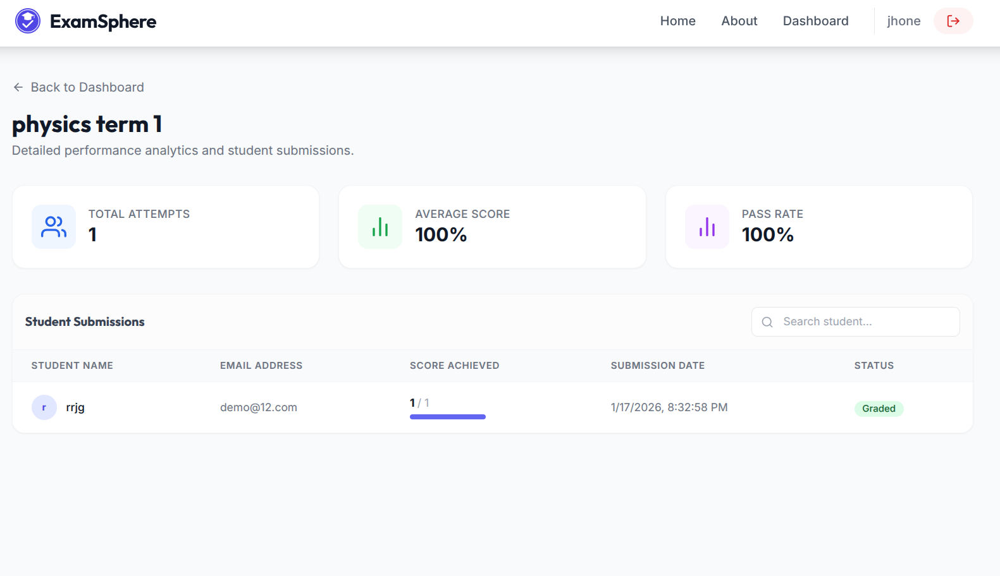

#### Create Test Interface
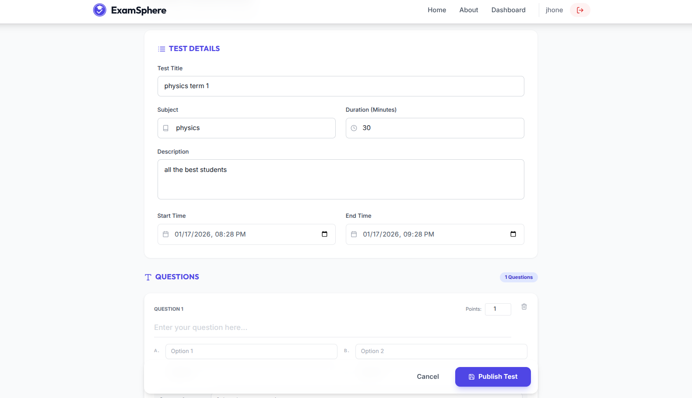

#### Student Dashboard
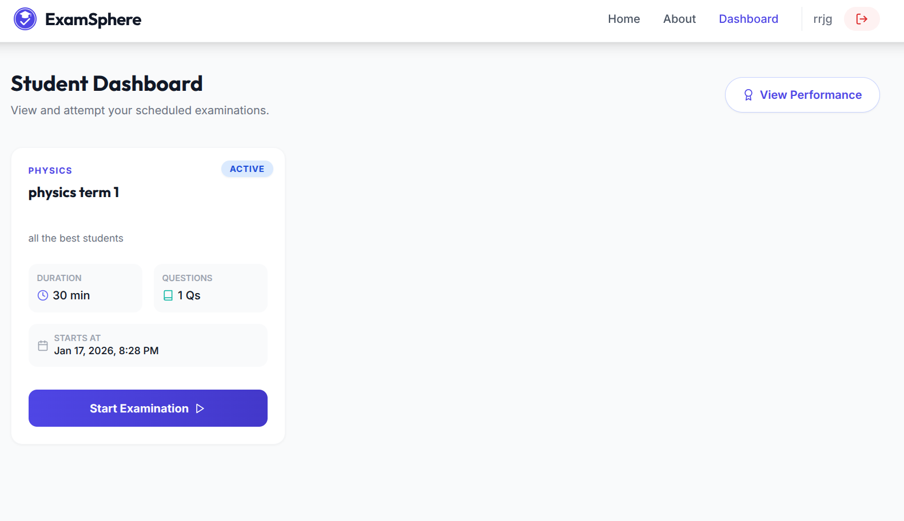

#### Student Test Taking Interface
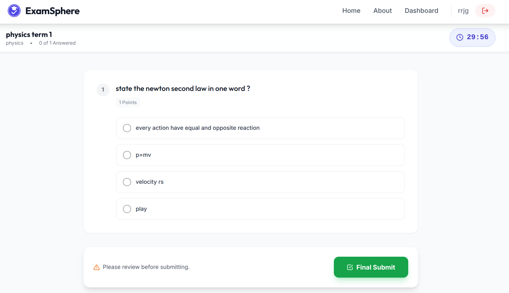

#### Result View
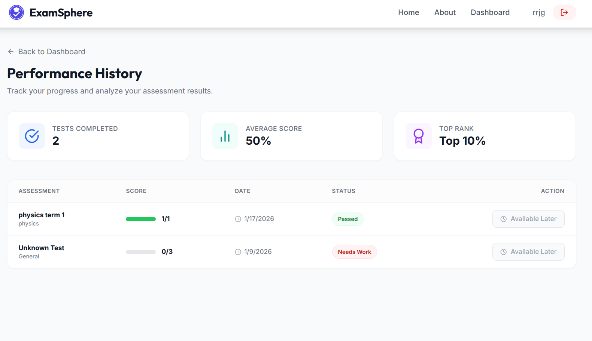

#### About Page
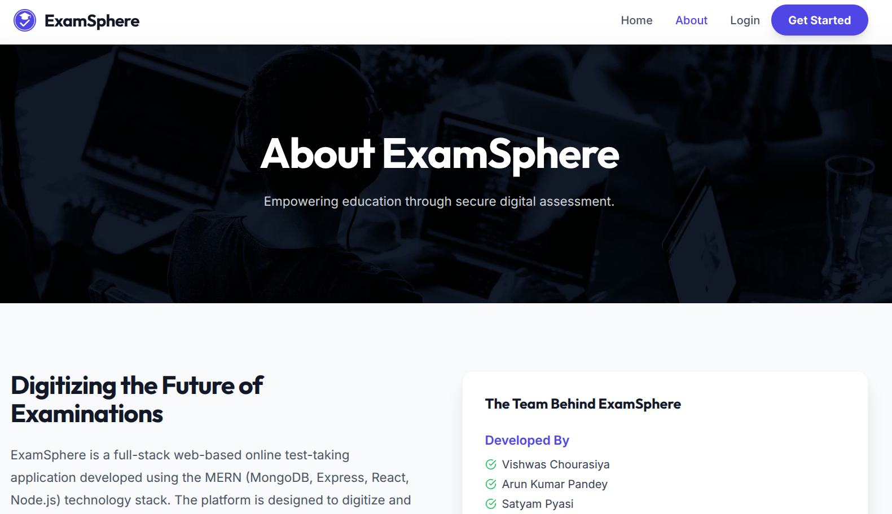

#### General Dashboard
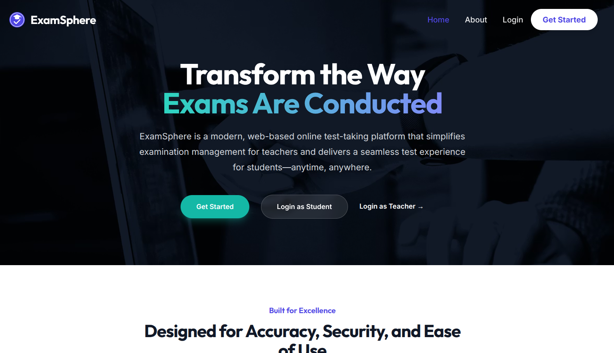

---

### 12. Testing Strategy
Ensuring the reliability of an examination platform is paramount. We employed a multi-layered testing strategy:

1.  **Unit Testing:**
    -   Tested backend utility functions (e.g., score calculation logic, date formatting).
    -   Verified database models to ensure required fields and validation rules trigger correctly.
2.  **API Testing (Postman):**
    -   Rigorously tested all REST endpoints (POST /login, POST /create-test) using **Postman**.
    -   Verified different response states: 200 (Success), 400 (Bad Request), 401 (Unauthorized), 500 (Server Error).
3.  **Integration Testing:**
    -   Validating the communication between the React Frontend and Node.js Backend.
    -   Ensured that JWT tokens are correctly attached to headers in Axios interceptors for protected routes.
4.  **UI/UX Testing:**
    -   Tested responsiveness on Chrome DevTools (simulating iPhone, iPad, and 1080p screens).
    -   Verified that Tailwind CSS classes render correctly across different browsers.
5.  **Security Testing:**
    -   Attempted SQL Injection (NoSQL Injection) and Cross-Site Scripting (XSS) attacks to ensure sanitization.
    -   Verified that students cannot access teacher-only routes.

### 13. Future Scope
The platform has potential for significant expansion to serve a broader educational ecosystem:

**For Schools & Institutions:**
-   **Multi-Tenancy:** Architecture support for hosting multiple schools on a single instance with data isolation.
-   **LMS Integration:** seamless integration with existing Learning Management Systems (Canvas, Moodle, Blackboard) using LTI standards.
-   **Blockchain Certification:** issuing tamper-proof, blockchain-verified certificates for course completion.

**For Teachers:**
-   **AI-Powered Question Generation:** Using LLMs (like GPT-4) to automatically generate questions from provided syllabus text.
-   **Advanced Proctoring:** detailed logs of tab-switching, browser focus loss, and optional webcam monitoring to ensure integrity.
-   **Subjective Answer Grading:** utilizing NLP to grade short-answer and essay-type questions.

**For Students:**
-   **Mobile Application:** A dedicated React Native app for offline test-taking capability (syncing when online).
-   **Gamification:** Badges, leaderboards, and streaks to encourage consistent study habits.
-   **Personalized Learning Paths:** AI suggestions for study material based on weak performance areas in tests.

### 14. Conclusion
The **Online Test Taking Web Application** successfully modernizes the traditional examination framework. By leveraging the power of the MERN stack and modern DevOps practices (Docker), it delivers a secure, scalable, and user-centric solution.

The project not only simplifies the administrative burden on teachers but also empowers students with instant feedback and a flexible testing environment. As educational paradigms shift towards digital-first approaches, this application stands as a robust foundation for the future of remote assessment.

### 15. References
-   **React 19 Documentation:** https://react.dev
-   **Node.js & Express:** https://nodejs.org/
-   **MongoDB & Mongoose:** https://mongoosejs.com/
-   **Tailwind CSS:** https://tailwindcss.com/
-   **Vite Tooling:** https://vitejs.dev/
-   **Docker Documentation:** https://docs.docker.com/
-   **JWT.io:** https://jwt.io/introduction

